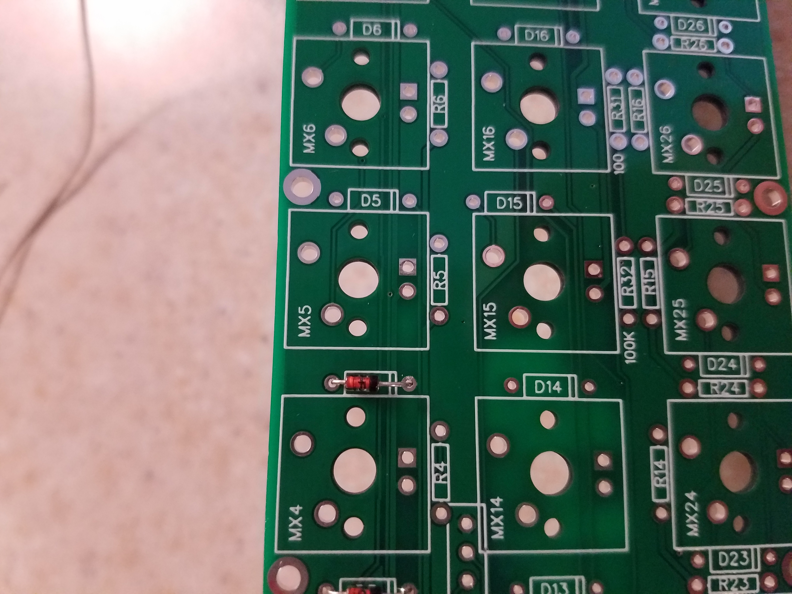
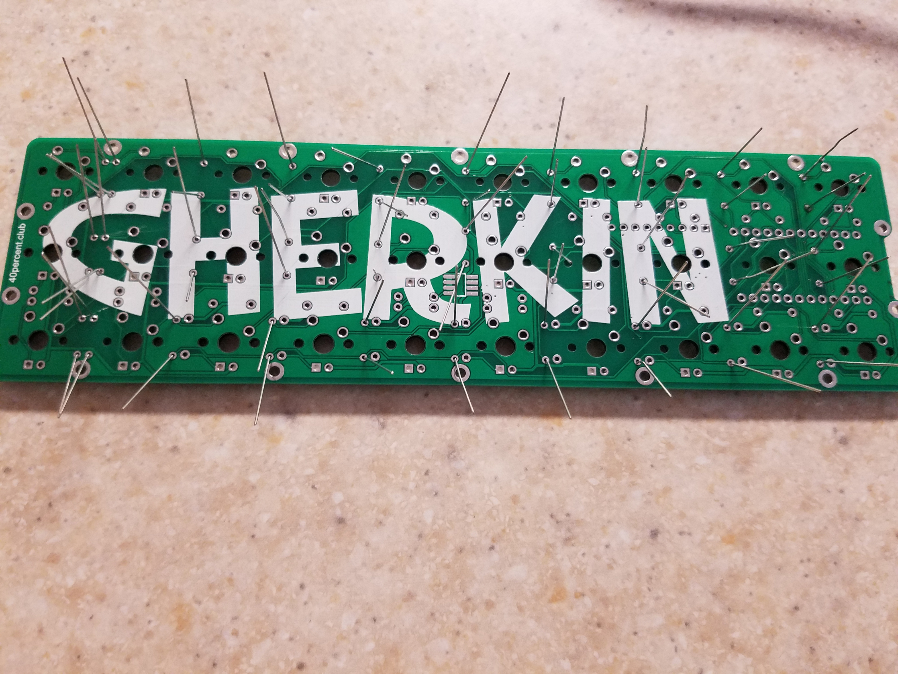
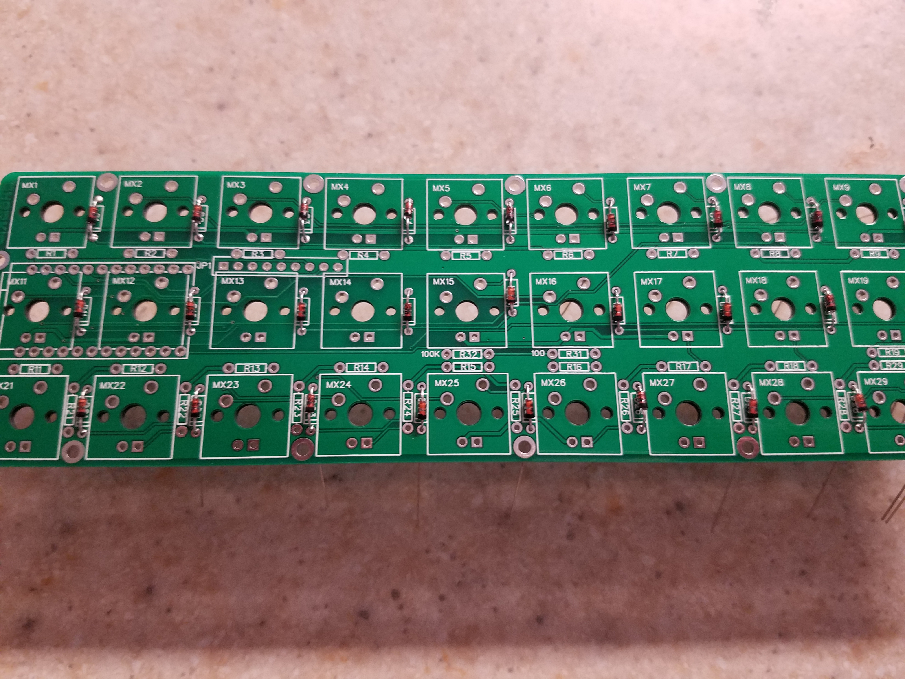
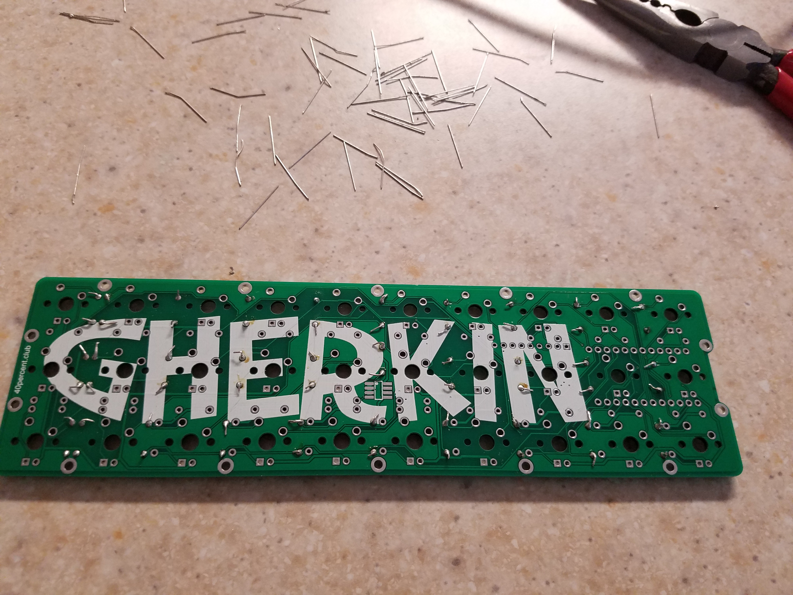

## Attaching Diodes ##

Diodes have to be facing a specific direction to work properly, so make sure the black line is on the same side as the white line in the diagram on the printed circuit board like this.

For the sake of time, it is easiest to install each diode in the proper direction and solder them after they have all been placed. The reason we are doing the diodes first is because they are the smallest part and thus do not get in the way of the installation of other parts.

Once the diodes have all been soldered in, clip them down to the base of the solder so that they all are small.

Save the clippings for a later step.

