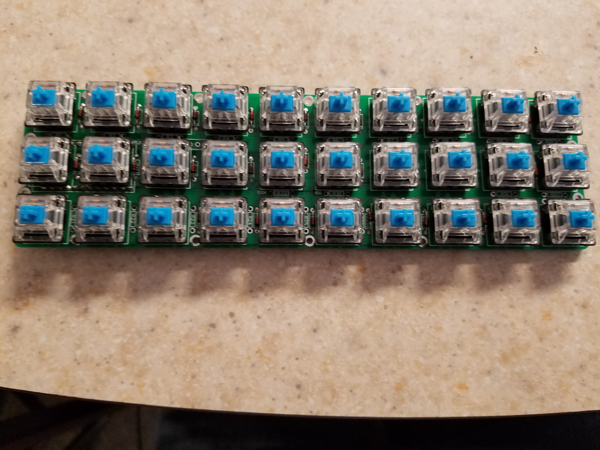
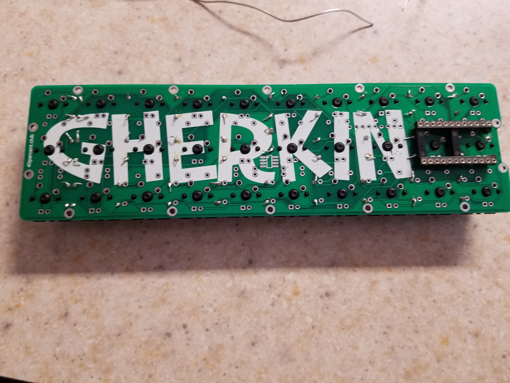
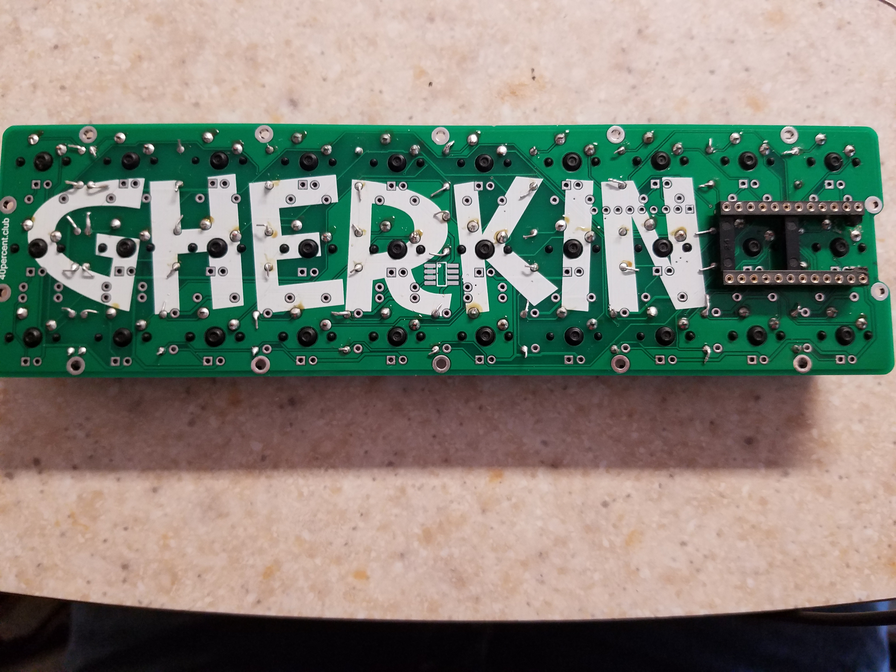

## Attaching Switches ##

After soldering the other key pieces, soldering the rest of the switches is much more simple. First install all the switches in their proper places, they should just pop into place.

After your keys are all installed, your keyboard should look something like this.

Insert your Pro Micro and get ready to flash your firmware.
The easiest way to flash the firmware is to attatch wires to these two test points.

[Previous: Socketing the ProMicro](https://github.com/johnriforgiate/English-516-Final-Project/blob/master/Socketing.md) | [Next: Flashing the Firmware](https://github.com/johnriforgiate/English-516-Final-Project/blob/master/FlashingFirmware.md) 
-----
