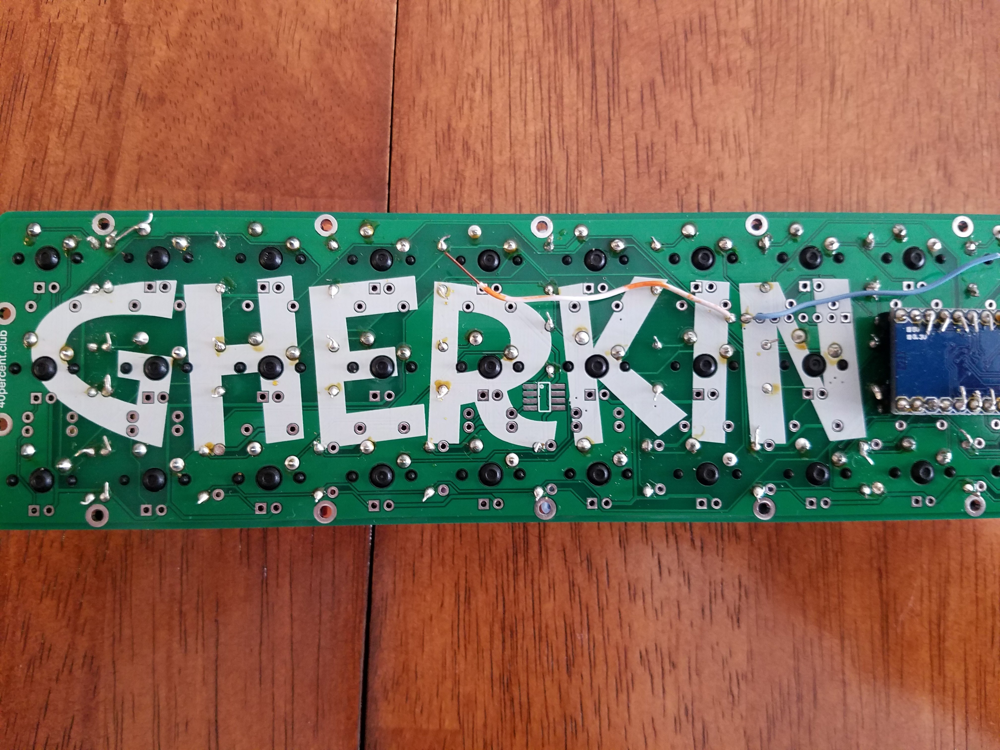

## Flashing Firmware ##

Flashing the firmware is the hardest part the first time you do it because it is easy to miss small things. The basis of flashing the firmware is plugging your keyboard in, then within the first 3 or so seconds, touching these two wires together twice, then sending a command to the Pro Micro from your computer to write the file.

[This guide about QMK](https://docs.qmk.fm/#/newbs), the custom firmware explains the process fairly well.

When I flashed my firmware it looked something like this.

[Previous: Attaching switches](https://github.com/johnriforgiate/English-516-Final-Project/blob/master/AttachingSwitches.md) | [Next: Works Cited](https://github.com/johnriforgiate/English-516-Final-Project/blob/master/WorksCited.md)
-----
