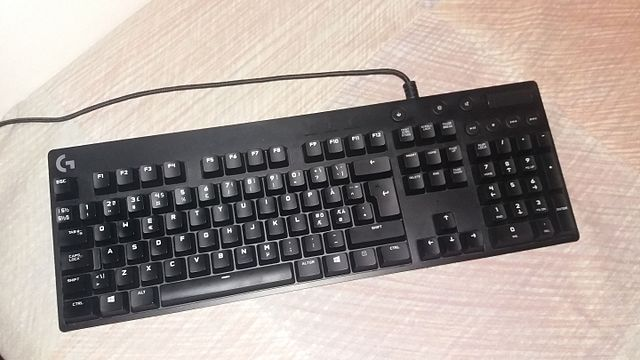
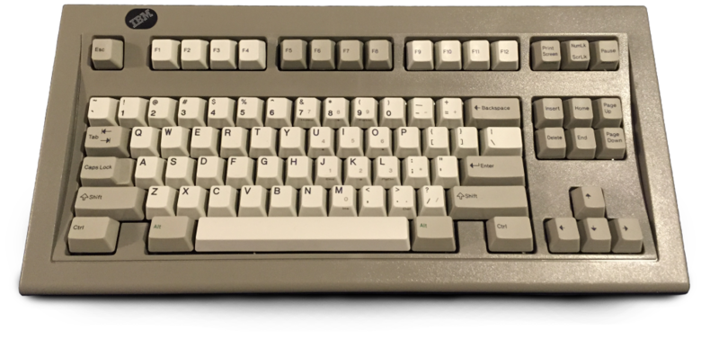
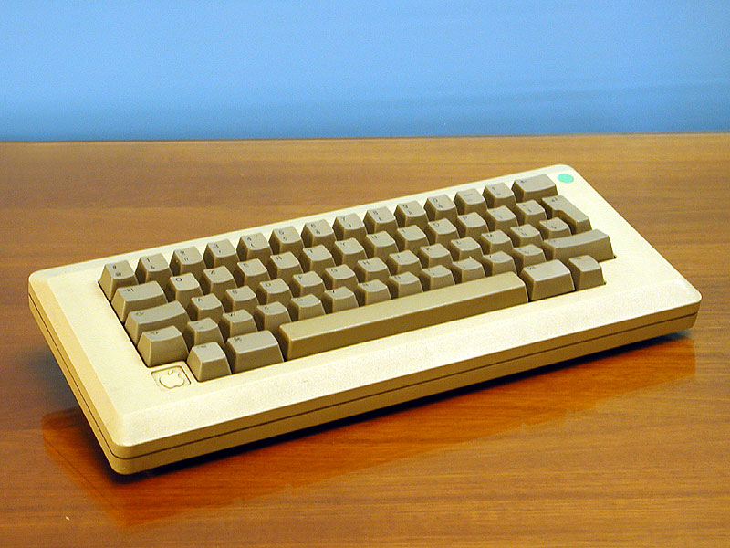
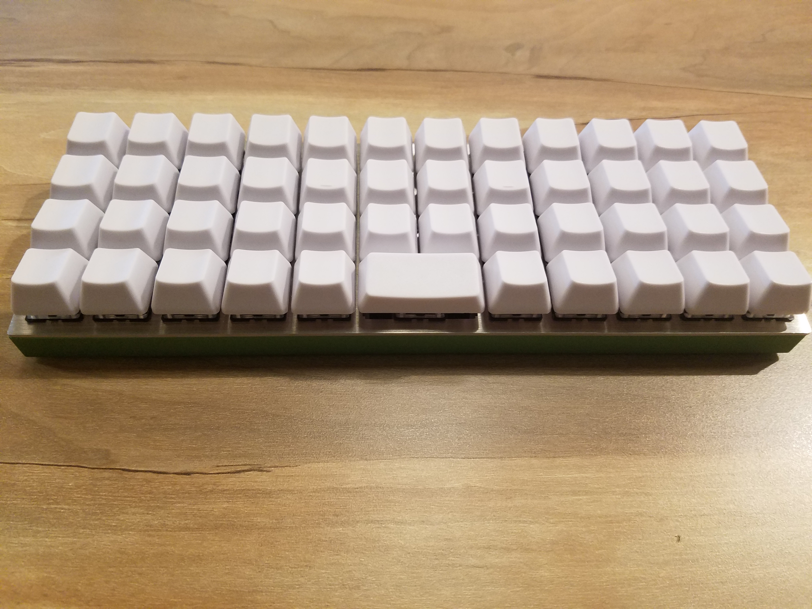
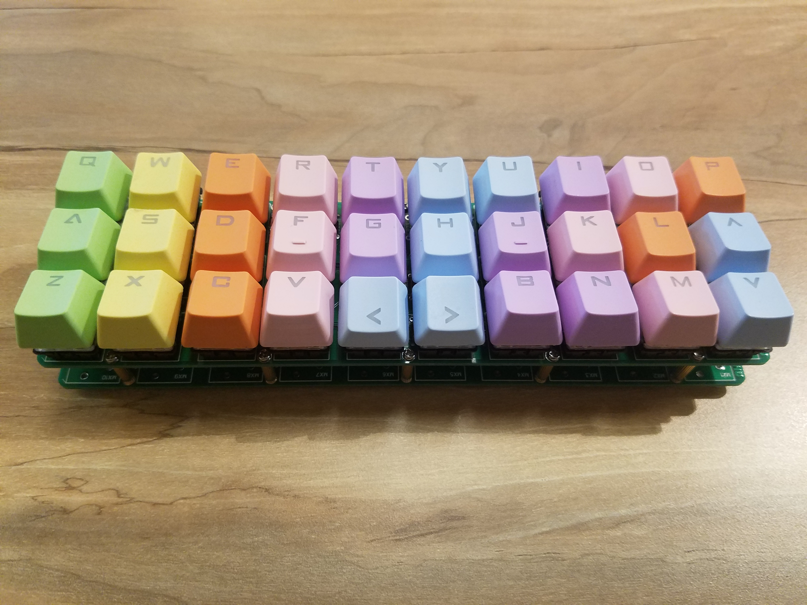

### Keyboard Size Types ###
---
Another large deciding factor for choosing a keyboard (especially if you are building your own) is the size and layout of the keyboard you are choosing.

#### Full-Size ####
A full-size keyboard is the classic keyboard with all the keys, including all the function keys. This is a perfect choice for someone who has a large desk and doesn't need their keyboard to be portable. While this keyboard is fine for those with large workspaces, I would argue that this is my least favorite size keyboard.

#### Tenkeyless ####
This keyboard is just as the name suggests, a keyboard that is missing just the numpad on the right or "tenkeys". A tenkeyless is good for those who are not planning on taking their keyboard anywhere, but still need it to be more compact for more desk space. I would reccommend this as the perfect non-portable keyboard because while it is missing some keys, the numpad often just takes up unneccesary space and makes it more difficult to switch between a keyboard and mouse when typing, and if it is really necessary, a separate numpad isn't a huge expense to free up valuable desk space.

#### 60% Keyboard ####
A 60% keyboard is the perfect portable keyboard for anyone who doesn't need lots of crazy features and functional keys, and often doesn't differ much from the functionality of a normal laptop keyboard. It is easy to carry around and is great for typing, taking away all the unneccesary keys that the Full-Size and Tenkeyless offer. 

#### 40% Keyboard ####
As the name states, this keyboard has 40% of the keys when compared to the Full-Size keyboard. 40% Keyboards are ultra-portable, as they are even smaller than 60% keyboards, but they come at the cost of losing some of the important keys that people rely on in their everyday life such as the number row. This is easily combatted by adding function layers that allow keys to send different signals when pressed in combination with other keys, for example the 'w' key can send 'w' but on a lower layer it sends '!' and a higher layer it sends '1'. This article is being typed on a 40% keyboard, and while I would reccommend it, it does have a learning curve, so I would usually reccommend either a 60% or Tenkeyless for a new keyboard user.

#### 30% Keyboard ####
How small can we go? This is a keyboard that takes the idea of a small keyboard to the limit, supporting only the letter keys and 4 others. This is the easiest one to build as it is so small, but it is difficult to reccommend it to new users because it actually changes the way that one types much more significantly as there need to be many more layer and row emulation keys to retain the same functionality that a regular keyboard does. It makes a great game controller for games with few buttons, but I would not reccommend it for typing or use in general.

---
While there are smaller keyboards, they are often made for specialized use and I will not cover them here.

[Previous: Choosing the Right Switch](https://github.com/johnriforgiate/English-516-Final-Project/blob/master/Switch%20Comparison.md) | [Next: Build Guide - Materials](https://github.com/johnriforgiate/English-516-Final-Project/blob/master/Materials.md)
-----
