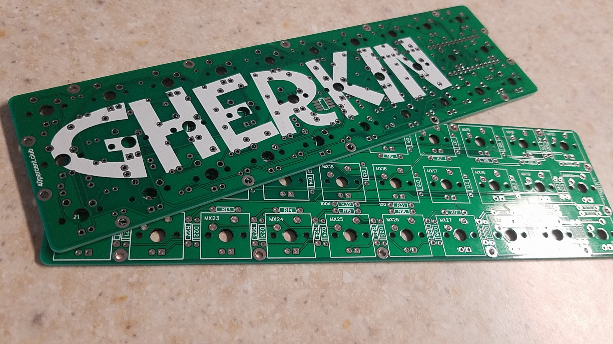

## Materials ##

To build the Gherkin keyboard you will need the following materials:

- 2 Gherkin Printed Circuit Boards (PCB)
  - I printed them using the website JLCPCB

 

- 30 Cherry MX type switches
  - I went with Gateron Blue switches, an alternative clone of Cherry Blue switches

 

- 30 1n4148 diodes
  - Diodes make a one way connection so that each key can be recognized distinctly

 

- 1 Sipper
  - Used to make the Micro chips interchangeable, which is important as they are often the highest probable point of failure

 

- 1 Arduino Pro Micro
  - I used a cheap clone off of eBay, it cost me about $5

 

- 1 Micro USB cable
  - Any old cable should work, but make sure it can transfer data or your keyboard will not work.

- 14 M2 6 mm Female Spacers

 

- 28 M2 4 mm Screws

 

## Skills/Tools ##

- Basic soldering skills
  - Many videos on Youtube cover this, it is much simpler than it seems once you try it.

- Soldering iron
- Thin leaded or unleaded solder meant for electronics
- Flux (this may be in the core of your solder, but is important for making solid joints

- Wire clippers or some kind of pliers
  - This will be used to cut long ends of soldered components

- Small Phillips screwdriver
  - With this the ability to screw things in

- Perserverance

- Some kind of computer with USB ports and the ability to install programs
  - You need to be able to write the software of the keyboard onto it.

[Previous: Understanding Keyboard Sizes](https://github.com/johnriforgiate/English-516-Final-Project/blob/master/Keyboard%20Size%20Types.md) | [Next: Attatching diodes/small parts](https://github.com/johnriforgiate/English-516-Final-Project/blob/master/AttachingDiodes.md) 
-----
