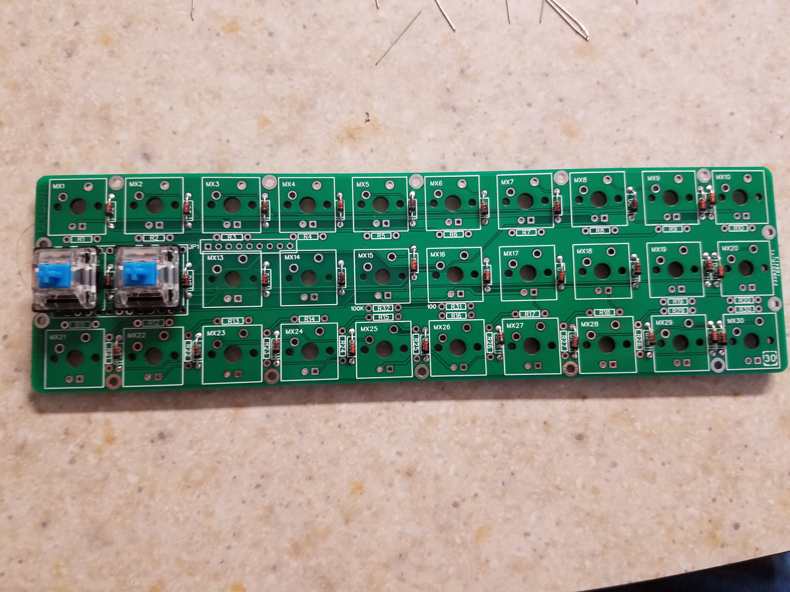
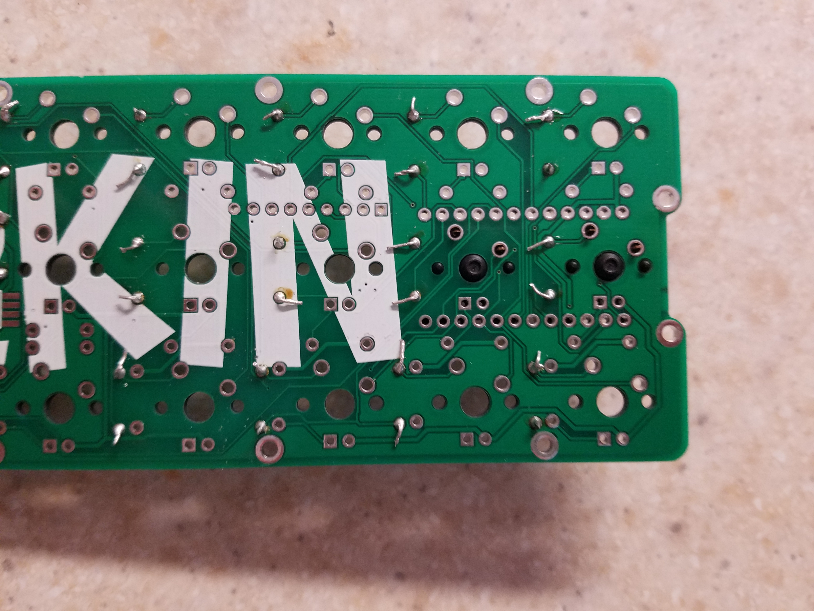
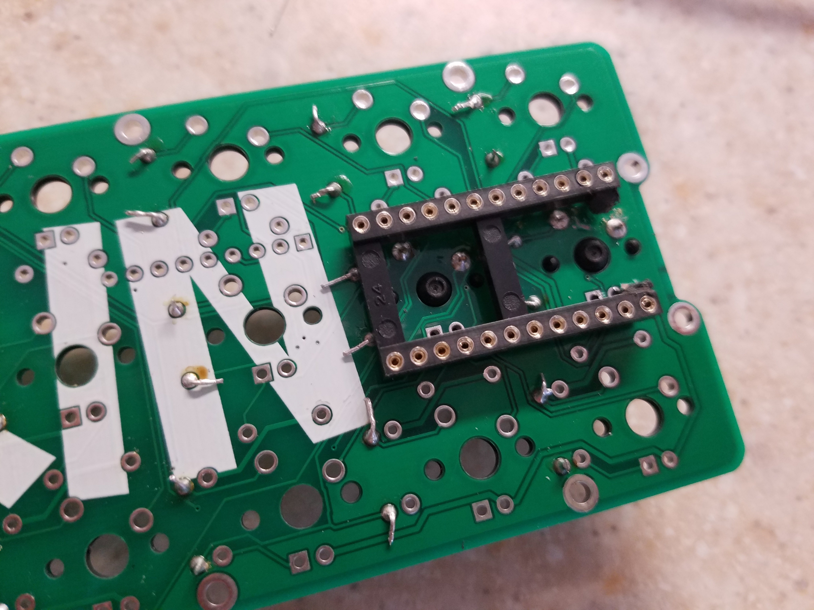
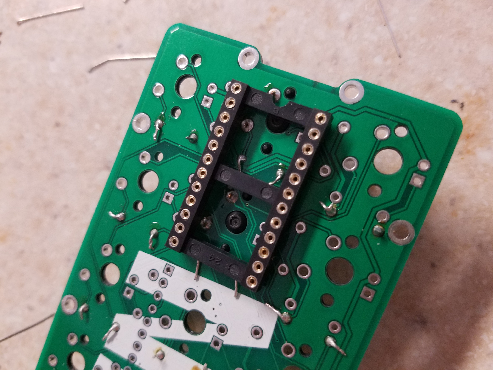
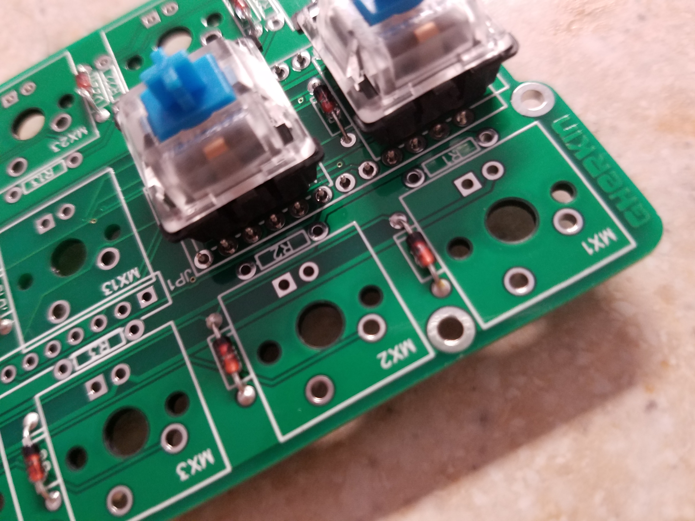
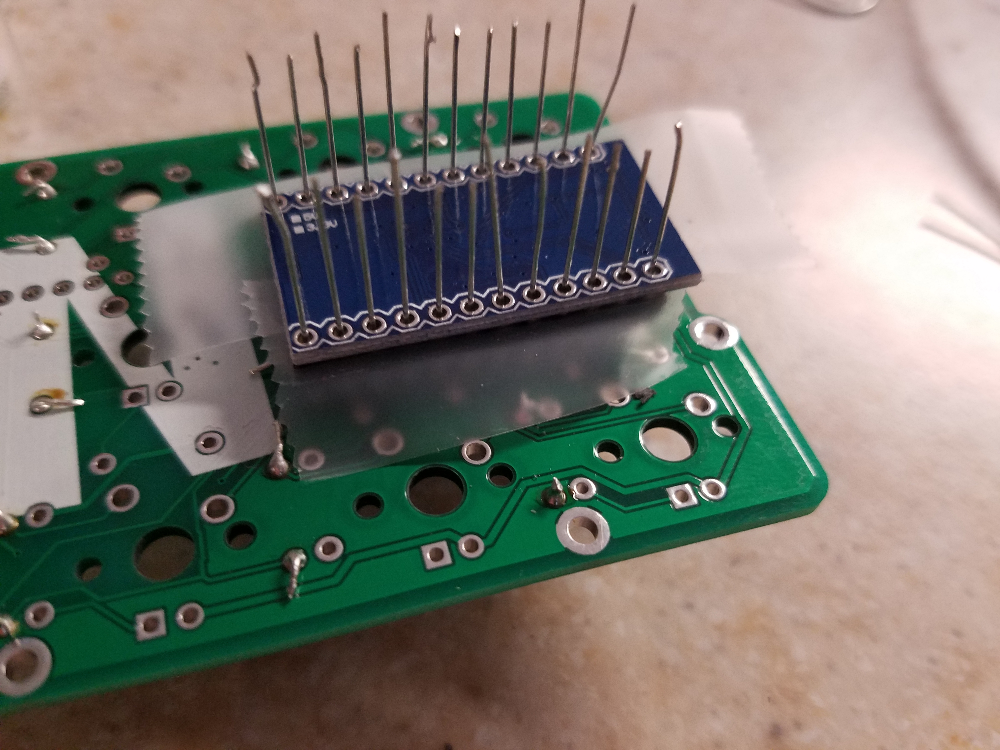
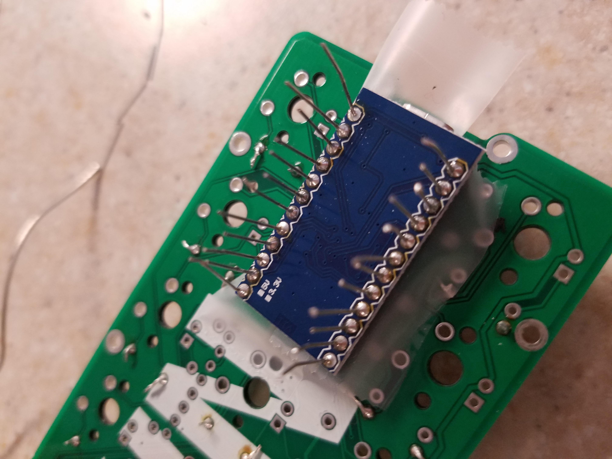
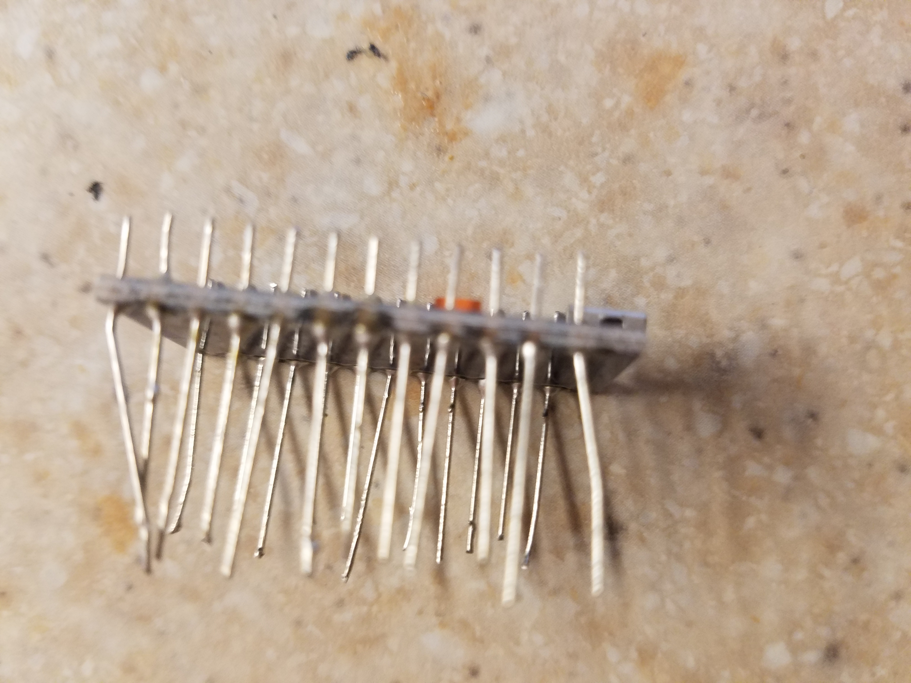
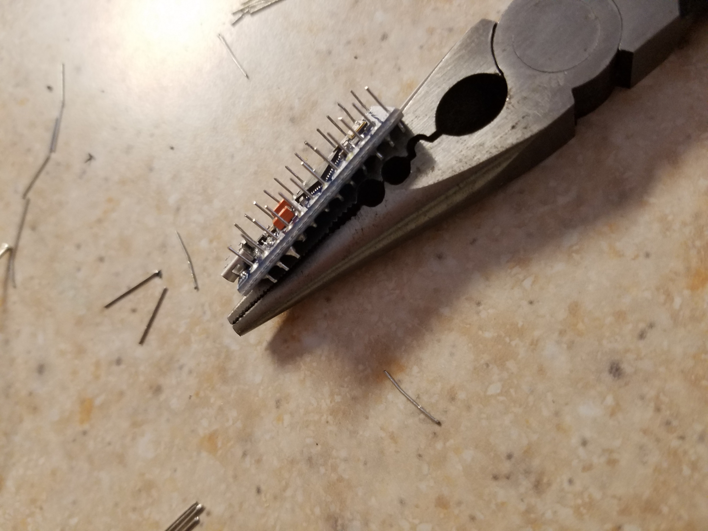

## Socketing the Pro Micro Controller ##

In this step, the Pro micro is socketed so that if it fails in the future it can be easily replaced without much hassle. 

The first step is to install the two switches that sit above where the socket connects because they are very difficult to do later.

One of the plastic pieces that hold the sipper together must be cut off for the Pro Micro chip to fit.

After these are installed, the Sipper socket must be installed.

In order to prevent the Pro Micro from being soldered to the socket you must apply tape to make sure the solder does not end up in the socket itself.

Then you attatch the Pro Micro so that the back is facing you and the micro USB is pointing out. Here you take the leftover leads from the diodes and insert them all the way into the socket.

You can then pull the Pro Micro from the board and admire your handiwork.

Finally, clip the long hanging ends of the leads off so they no longer hang out.

