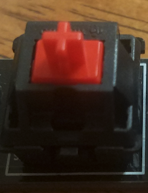
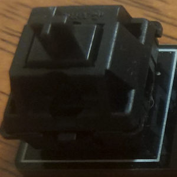
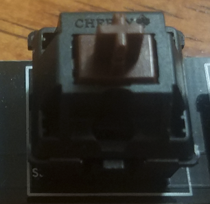
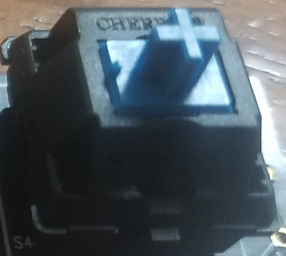
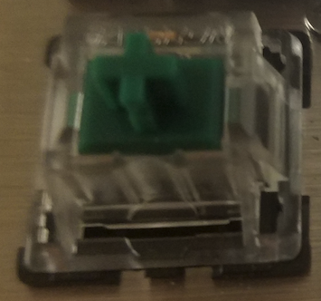

### Switch Comparison ###
---
#### Consider your needs! ####
The first point I want to stress before getting into this mini article is that it is crucial that you consider what you want to be doing with your mechanical keyboard. Are you playing First-Person Shooter style games where quick reactions are crucial to your keyboard experience? Are you a writer who just wants a more satisfying keyboard that will keep you typing for hours on end because that is what you need to do to get your work done? Are you somewhere in between? Do you like to play real time strategy games that require repeated pushes of the same button rapidly? 

#### Try before you buy! ####
While trying a keyboard that has the exact switches you want may be out of the question, it is not a bad idea to at least get a feel for what you may be typing on. If you have any friends with mechanical keyboards, ask them what they think about their switches. Some electronics stores such as Best Buy have mechanical keyboards on display for customers to get a feel for. If all else fails, I would recommend buying a switch tester kit from eBay. They run anywhere between $5-10 and are a good way to get a feel for exactly what you are getting.

#### Introducing Switches ####

##### (Cherry MX Style) Reds #####
Reds are the lightest of switches, actuating at only 45g, these are often popular with gamers who want lighning-fast reactions. Reds are a linear type switch, meaning that they have no feedback or click when the signal that they have been pressed down has been registered by the computer. Because they are so light it is very easy to press them for long periods of time without fatigue. Reds are popular with gamers who play First-Person Shooters or MOBAs.

##### (Cherry MX Style) Blacks #####
Blacks are like the big brother of Reds. Blacks are also linear, but actuate at 65g, and thus have a much heavier feel. Because of their much higher actuation force, it is much more difficult to press wrong buttons as they take a significant ammount of extra pressure to register. They do not have any tactile feedback like the Reds due to their linear nature, and so they are somewhat difficult to type with. Blacks are also popular with gaming crowds, especially Real-Time Strategy gamers because they allow for many actions to happen as they lack the tactile feedback.

##### (Cherry MX Style) Browns #####
Browns are often a compromise between typing and gaming switches. They are tactile by nature, and provide a quiet click of feedback when they have activated. Browns actuate at 45g, making them just as heavy as the Reds, but the click that happens when they are activated makes them much more comfortable for typing. Browns are perfect for someone who wants to play games but also has to write papers, a good middle ground for most college students.

##### (Cherry MX Style) Blues #####
Blues are the classic key for typing. Blues actuate at 50g of force, so they require more force than Browns to type. This makes them less popular for gaming, but Blues really shine when you have to type for long periods of time, they are difficult to make mistakes with and don't necessarily tire one's fingers out any more than the next keyboard. The force required to actuate a Blue switch is similar to that of a membrane keyboard. One thing to note is that Blues are very loud.

##### (Cherry MX Style) Greens #####
Green switches are the bigger brother of Blues. Greens actuate at a whopping 75g, the heaviest switch on this list. I would not reccomend these for gaming, but they make for an incredible typing experience. Greens have a tactile click, and are similar to blues in many ways, but can be fatigueing for people who are not used to typing on mechanical keyboards and I would not reccomend Greens to anyone who is getting a mechanical keyboard for the first time. This entire article was typed with Greens.

##### Imitation Switches #####
Many of the imitation brands such as Gateron and Outemu provide a very comparable typing experience with those of Cherry brand switches and I would reccomend using them if budget is a big deal in choosing your keyboard.

##### Other Switches #####
Other mechanical and mechanical like switches such as Alps and Topre exist, but I would not reccomend them to someone who is getting their first mechanical keyboard because the options to customise them are much more limited and they often cost much more then MX Cherry style switches.

https://wiki.installgentoo.com/index.php/Mechanical_keyboards
- was referenced for switch actuation forces
