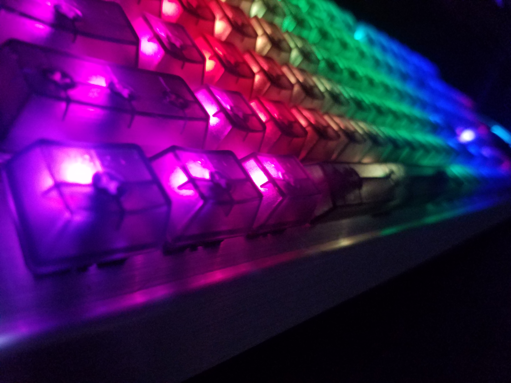
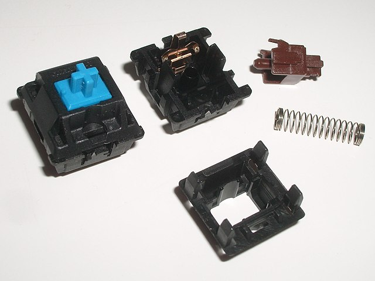

# Why Mechanical Keyboards? #

### The Current Keyboard Scene ###
In the beginning, keyboards were all mechanical and had switches that would click upon being depressed. However as technology moved forward, the need for smaller, quieter and more portable keyboards became the norm. Laptops and desktop alike sported the membrane keyboard. Instead of receiving a satisfying click as the switch sent the signal to the computer, a membrane would send the signal with a squish.  

While the price of membrane keyboards often cannot be beat (they usually are free with the computer) there are still many reasons to favor mechanical keyboards. With the continuing rampant prevalence of online shopping, it is becoming easier and cheaper to purchase mechanical keyboards, and one of the primary reasons not to get one has been eliminated.

### Satisfying Key-presses ####
Membrane keyboards do not offer feedback when they are used. Compared to the slight mush of a membrane keyboard, mechanical keyboards either add the feedback of a reassuring click or remove any feedback at all and just keep a linear progression that removes the mushy feeling of a membrane.

Image courtesy of Wikipedia under the Creative Commons liscence.

### Customizability ####
Mechanical keyboards add a level of customizability that membrane keyboards are unable to achieve. Most switches are made with the same Cherry MX style, which means that most keyboards are able to use keycaps from any mechanical keyboard or any set that is made for MX style switches. This allows users to chooses from a variety of different colors and shapes to fit their specific style. Additionally, Mechanical keyboards have many different types of switches that are good choices depending on the user's typing style.

### Computer Use ####
While those that do not use computers that often may not appreciate the benefits of using a mechanical keyboard, writers, coders and gamers often swear by mechanical keyboards. If you are someone who occasionally has to type for more than even 30 minutes at a time, I would recommend a mechanical keyboard to you.

[Previous: Table of Contents](https://github.com/johnriforgiate/English-516-Final-Project/blob/master/Switch%20Comparison.md) | [Next: Choosing the Right Switch](https://github.com/johnriforgiate/English-516-Final-Project/blob/master/Switch%20Comparison.md)
------------
